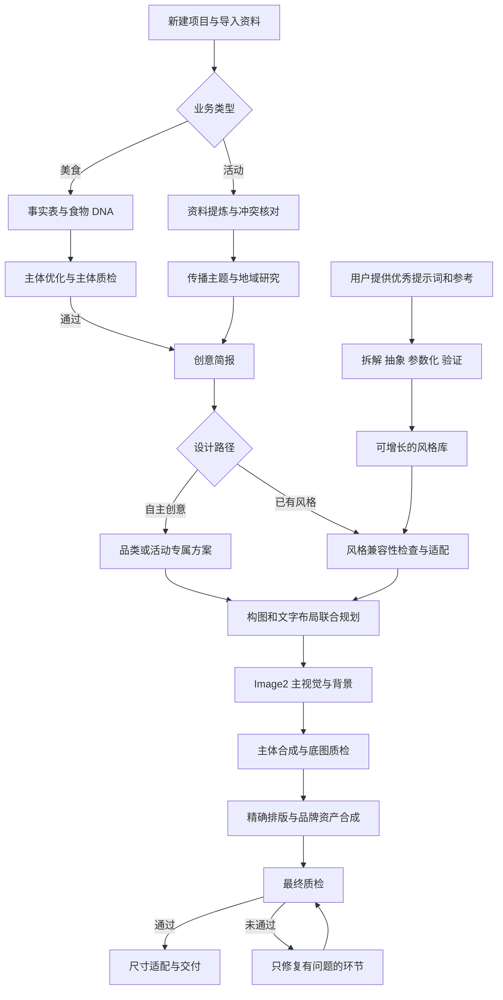

# 宣传海报生产系统 · 产品规格 v0.1

原始设计日期：2026-09-05。本文件保留完整产品蓝图。后续用户已选择先开发可移植 Agent；当前 v0.1.0 的实际实现、限制和验证见 [README](README.md) 与 [实施状态](docs/IMPLEMENTATION-STATUS.md)，不能将本蓝图全量视作已实现能力。

## 1. 产品说明与边界

这是一个以 Image2 为主视觉生成引擎、面向美食 KV 和活动宣传 KV 的创作生产系统。用户提供素材和事实，系统完成分析、创意、构图、出图、排版、质检、修改和多尺寸交付；用户持续提供优秀提示词，系统将其沉淀为可以跨项目复用的风格包。

核心价值是：让每张海报属于当前产品或活动，同时保住真实主体、准确信息和可复用的设计经验。

### 已明确的需求

- 两类业务：美食 KV、活动宣传 KV；每类都有「交给我创意」「选择已有风格」两条入口。
- 美食必须保留用户原图中的食材外观、结构和装盘；允许提升光线、色彩、背景与构图表现。
- 信息包括主标题、副标题、Slogan、核心食材、3–5 个卖点、地址、电话等；按场景选填，不能为凑字段编造。
- 活动先收集与分析材料、明确主题，再设计；地域研究服务于活动表达。
- 风格库逐渐增长，新增风格来自用户给的提示词及参考资料。

### 本版设计假设

- 首版按单人创作生产台设计。部署方式尚待本项目偏好确认，暂以 Mac 本地应用为界面载体；生产契约可用于 Agent 工作流或后续网页客户端。
- 默认先产出一张主 KV，再适配所选尺寸。默认提出 3 个概念方向，但只生成选中的 1 个，减少无用调用。
- 本项目从空目录开始，未把旧美食项目的代码、模型配置、规则仓库或验收结论视为本系统已经具备的能力。
- 这是一份可供评审和开发的设计草案；供应商、账号、预算、正式风格样本、真实业务样本仍是实施期输入，不影响本次系统设计交付。

### 四条生产约束

1. **主体身份与事实 > 品牌规范 > 传播主题 > 风格 > 装饰效果。** 风格只能改变允许变化的维度。
2. **单张照片不能同时保证原结构完全不变又任意换拍摄角度。** 默认固定视角；需要新角度时补图，或单独接受推断模式。
3. **提示词不能承担全部保真与准确性保证。** 使用主体保护、可编辑图层、事实白名单和输出质检共同约束。
4. **“世界级”作为创作目标，以作品评审衡量。** 模型自报高分不等于达到该目标；可验证的硬标准与人工审美评价分开记录。

## 2. 系统组成

| 模块 | 主要职责 | 交付给下一环节 |
|---|---|---|
| 项目与资料台 | 导入图片、文档、PPT、链接、品牌素材 | 带来源与版本的素材清单 |
| 信息分析器 | 提取事实、冲突、缺失；生成文案草稿 | 项目事实表、正式文字白名单 |
| 主体保护器 | 食物 DNA、器皿、品牌 Logo、IP 身份与遮罩 | 主体锁定合同 |
| 创意导演 | 提炼传播命题、品类语义、地域语义、视觉隐喻 | 创意简报与构图方案 |
| 风格库 | 学习设计语法、匹配项目、管理版本与验证范围 | 固定版本的风格包 |
| 生产编排器 | 规划步骤、调用模型、检查依赖、记录成本、恢复任务 | 图像与步骤证据 |
| 排版与合成器 | 字体、文字层级、Logo、二维码、精确布局 | 可编辑海报工程与成品 |
| 质检与成品库 | 核对主体、信息、视觉、尺寸，保存修订 | 可追溯的最终交付包 |

图中「通过」必须来自对应素材版本的质检记录；修改主体、事实、风格或布局会使受影响的下游记录失效，不能沿用旧 PASS。

## 3. 两条创作路径

### 3.1 美食 KV

1. 上传一张主图，可补充同一产品的细节图。多菜品时分别建立主体，明确主次，不能拼成不存在的新菜。
2. 自动检查清晰度、遮挡、器皿完整性；提取可见 DNA，用户信息与视觉观察分别存储。
3. 显示简洁的「本次锁定」卡：食物身份、数量/无法确定、形态、装盘、器皿、固定视角。用户可以修正识别。
4. 建立无正式宣传文字的商业主体母版（Stage A），完成原图对照质检；原图足够好时可直接以原图派生的保护主体通过 A，无需强制付费重绘。
5. 「交给我创意」根据品类、质地、冷热、客群与传播目标提出方案；「选择已有风格」在相同 DNA 下装载风格包。
6. 先做标题、主体、信息区的联合构图，再生成背景和必要视觉元素；合成已通过的主体，输出无正式文案的 KV 底图。
7. 完成排版、Logo 与二维码等准确资产合成，进行主体与成品双重检查。
8. 用户修改文字、背景、风格、主体占比，系统只重跑必要步骤；母版与原图一直可对照。

详见 [美食生产规则](docs/FOOD-PLAYBOOK.md)。

### 3.2 活动宣传 KV

1. 导入已有文件与品牌素材，不要求用户手填资料里已经写明的字段。
2. 提取活动名称、目标人群、核心价值、行动目标、时间、场地、报名方式、组织与赞助层级；展示每条事实的来源。
3. 优先处理影响发布的冲突。缺少可选素材时继续分析；缺少关键事实时可做概念草稿，但不能作为正式海报交付。
4. 定义一句传播主题，再选主视觉概念。活动法定/正式名称与创意标题分开，不能以新主题替换正式活动名称。
5. 按需要调研地点，构建少量地域候选。每个符号必须说明与活动的关系、画面作用和来源；没有合适连接时可以不使用地标。
6. 自主创意或选用风格，都必须满足主题、事实、品牌资产身份与信息密度。
7. 生成主视觉，精确合成正式文字与资产，检查日期、地址、报名入口、Logo 层级与 IP 外观。

分类、资料规则与西安假设案例详见 [活动生产手册](docs/EVENT-PLAYBOOK.md)。

### 3.3 减少确认次数

用户可以选择「直接完成」或「先看方向」。直接完成允许系统在已授权预算和约束内自选方向、运行质检、定向重试；先看方向只在一次概念选择处停下。事实冲突、超出预算、突破 DNA 或品牌规范必须单独处理；普通光色、留白和字距调整不反复确认。用户主动要求等待验收或“启动”时，以该门禁为准。

## 4. 输入与事实管理

### 通用输入

项目名称、海报用途、目标受众、希望观众采取的动作、创意路径、品牌规范、发布尺寸、主副标题、Slogan、必须展示/禁止展示的信息、输出预算与交付模式。

支持设计范围：PNG/JPEG/WebP/HEIC 图片；PDF、DOCX、PPTX、TXT/Markdown 文档；网页链接；SVG/PNG Logo、二维码、IP 标准图。HEIC 等先本地规范化并保留原件，实际发给供应商的格式由接入能力决定。老式 DOC/PPT 若未实现可靠解析，提示转换；受保护链接可让用户提供导出文件，不能将访问失败当作资料为空。

### 美食字段

| 字段组 | 字段 | 缺失处理 |
|---|---|---|
| 主体 | 主图、菜品名、单品/组合、核心食材、数量与份量 | 主图必需；不可从外观推断配方或份量 |
| 定位 | 品类、制作方式、温度感、质地、客群、消费场景 | 可给分析建议，和已证实信息分开 |
| 文案 | 主标题、副标题、Slogan、3–5 个卖点、价格/优惠条件 | 不足 3 点也可生产；写文案草稿，不编造事实 |
| 品牌与联系 | 店名、Logo、地址、电话、真实二维码 | 按用途选填，缺少则不显示 |
| 限制 | 禁改部位、背景禁用项、允许的装饰、保真模式 | 默认严格保护主体和器皿 |

### 活动字段

正式名称、类别、传播阶段（预告/招募/开幕/现场/回顾）、主办与承办、受众、核心看点、举办日期和时间及时区、举办地点与详细地址、报名截止、参与条件、费用与优惠、奖项、行动入口、赞助级别、Logo 与 IP 规范。

`FactSet` 每个事实记录 `value / status / source_asset_id / page_or_slide_or_url / extracted_at / evidence_excerpt / revision`。统一状态为 `provided`（已提供）、`verified`（已核实）、`inferred`（推断）、`conflicted`（冲突）、`missing`（缺失）。只有无冲突的已提供或已核实事实可支撑正式事实主张；推断不能自动成为发布承诺。

`CopySet` 独立记录 `exact_text / fact_refs / copy_status / adoption_basis / revision`；状态为 `proposed`（提案）、`adopted`（已采用）、`superseded`（已替换）。非事实性标题和 Slogan 可由用户采用，或由系统在「直接完成」已授权范围内选定；价格、日期、优惠条件、用户锁定文案的实质改变不能由创意授权覆盖。仅已采用且事实检查通过的 CopySet 项进入当前 `copy_allowlist`，所有修改保留版本。

用户最新明确修正优先于旧材料，保留来源差异；多个文件出现互斥信息时不凭发布时间自动裁决。公开调研只能补充地域与文化背景，不能替代主办方确认具体活动日期或价格。

## 5. 创意导演与排版标准

### 创意必须给出可执行的决定

每个方向交付：传播命题、画面主角、品类/活动关联理由、视觉隐喻、构图草图、颜色角色、用光方式、背景空间关系、字体性格与布局、信息阅读顺序、主体保护边界、适配限制。

「高级、大片、世界级、视觉张力拉满」只能作为目标，不能代替这些决定。默认给出 3 个差异明显的方向：它们应在构图、空间组织、媒介或视觉概念上有区别，不能只是换颜色。

### 排版从策划开始

1. 先确定信息优先级：主诉求 → 关键证明/利益点 → 行动与联系。活动可采用主标题与时间双焦点，但阅读顺序必须明确。
2. 由字数和主体轮廓决定版面。主标题、主物、品牌区、卖点区、行动区各有位置约束、最小尺寸、允许换行和安全区。
3. 选择字体的骨架、笔画粗细、宽窄、时代感与品类气质。默认最多 2 个字体家族，功能字重可更多；品牌指定字体优先。
4. 装饰字体用于短主标题，信息文字优先清晰。中文避头尾标点、数字单位不误拆、电话和日期保持可读分组；英文只在确有内容或品牌需要时出现。
5. 提前为标题留出合适的明暗与细节密度，也允许标题与主体前后穿插；不能遮挡关键食材结构、器皿特征、Logo 或行动入口。
6. 通过尺度、留白、对比、节奏、光影与视线动线产生张力，避免每种品类都使用爆炸飞溅或金色大字。
7. 3–5 个卖点按主次编排，可以是一主三辅，不必排成同样大小的胶囊标签。文案太长先报告容量，再重新编排或给缩写建议，不悄悄删字或缩成不可读。
8. 缩略图检查主次，实际投放尺寸检查可读性，100% 检查字形与细节；阈值按渠道配置，不宣称一个字号适用于所有海报。

背景的空间感应体现前中后景、光线方向、虚实和材质的关系。选择平面图形风格时，改用叠层、留白、比例和图底关系表达空间，不能机械叠加景深效果。

## 6. 风格库不是静态列表

风格组织为「风格家族 → 可执行风格包 → 参数预设」，业务类型和品类用于筛选与适配，不复制同一个风格包身份。项目模板可以引用固定的风格包版本和预设；项目实例保存本次事实与输出。品类是内容属性，风格是设计方法，两者分开。

新增流程：上传提示词/参考 → 提取设计逻辑 → 清理原案例品牌和事实 → 与已有风格比较 → 新建家族或扩充既有包 → 参数化 → 检查兼容性 → 真实案例验证 → 在通过的范围内上架。

同一风格可以适配美食与活动，但分别声明主体、信息密度和品牌约束。默认仅展示当前项目可用的已验证风格；试验风格有清楚标记。只有提示词、没有实际效果图时，可以分析意图，不能宣称视觉效果已被证实。

初始只有自主创意规则与一个原创示范风格规范；目前没有用户提供的风格样本，也没有已验证风格。可逐步建设「光影剧场、编辑式留白、复古印刷、潮流图形、微缩场景、地域叙事、竞技动势、几何空间」等候选家族；这只是待研究目录，不能作为已上线能力。

完整字段、学习流程与元提示词见 [风格库设计](docs/STYLE-LIBRARY.md)。

## 7. 工作台与交互设计

### 信息架构

左侧导航：项目、风格库、品牌与资产、成品库、生产记录、设置。首页两张清晰入口：「美食 KV」「活动宣传 KV」，第三个次级动作「添加新风格」。

项目内顶部依次为「资料 → 设计方向 → 制作与修改 → 交付」，后台保留更细的生产状态。用户无需阅读步骤代号或提示词才能操作。

### 核心制作页

- 建议桌面宽布局：左侧可折叠资料栏约 280 px，中央画布自适应，右侧属性栏约 300 px；小窗口将属性移入抽屉，画布优先。
- 中央视图切换「原图 / 主体母版 / 海报」，提供拖动对照、缩放、文字与安全区叠加、不同尺寸切换。
- 右侧按当前选择显示「文案、字体、背景、主体、颜色、品牌、尺寸」。锁定项用锁标记并说明来源。
- 底部显示当前进度、已用成本、已完成版本。任务可暂停、取消后续步骤、恢复、回到某版本。
- 主要动作根据状态变化：「整理资料」「生成海报」「应用修改」「导出」。按钮旁只显示影响用户决定的范围或预计费用。

### 修改行为

| 用户操作 | 处理范围 |
|---|---|
| 改电话、时间、地址、短标题 | 更新文字层并复查布局与事实；不重绘食物 |
| 改成长标题或增加赞助商 | 先检测容量，重排布局；仅在留白不够时重做背景 |
| 换背景、光色、风格 | 复用通过的主体，重新生成对应视觉层并做下游质检 |
| 换食物主图或要求改变装盘 | 建立新的主体版本，原 DNA 与下游验收失效 |
| 换尺寸 | 保持主题和身份，重排构图；必要时补背景，不拉伸整张海报 |
| 「更有冲击力」 | 显示可理解的修改方案，如增大主物、改变标题尺度、提高明暗反差；不把此要求解释为改变食物结构 |
| 某个结果质检失败 | 标出具体区域和原因，提供定向修复，不能仅显示一个分数 |

### 风格库页面

按业务、品类、适配比例、信息容量、状态筛选。卡片展示真实验证缩略图、风格名、适配范围和版本；没有案例图时显示「待验证」，不使用假案例。详情能查看设计逻辑、原提示词来源、去案例化规则、参数、对照案例和变更历史。

界面建议使用暖白、炭灰和一个克制的动作强调色，画布周边保持中性；海报本身决定视觉色彩。界面不统一施加蓝紫渐变或黑金装饰。

## 8. Image2、主体合成与文字的分工

### 当前模型信息核实

截至本次核查，OpenAI 官方将 `gpt-image-2` 定义为支持图像生成和编辑的模型，支持图像输入。系统把用户所说的 Image2 映射到明确的供应商与模型版本，不能仅凭兼容网关显示的名字认定后端模型身份。[模型说明](https://developers.openai.com/api/docs/models/gpt-image-2)

官方指南目前说明：可经 Image API 生成或编辑；`gpt-image-2` 图像输入自动高保真，无需传 `input_fidelity`；精确文字、构图与跨次一致性仍存在局限。超过 3,686,400 像素的生成仍属实验范围；透明背景为预览能力。本设计因此默认使用经过验证的尺寸和本地主体合成，不将模型精度或预览能力作为保证。[图像生成指南](https://developers.openai.com/api/docs/guides/image-generation)

这些是官方声明核查，尚未对用户的实际供应商做出图测试。实施时重新核实能力，不固定旧版本参数。

### 推荐默认：联合规划、分层生产

**Image2** 负责主视觉、背景、环境、材质、氛围与允许的图像编辑；**布局规划器** 同时设计文字和主物空间；**合成器** 负责保护主体、正式文字、Logo、二维码及可编辑图层。系统仍以 Image2 为主视觉核心。

文字合成不等于模板角落贴字：文字可以有大尺度、轮廓造型、遮罩穿插、投影与材质，但正式字形由本地字体或经过确认的矢量字形控制。Image2 生成的标题材质可以裁进准确字形，不能覆盖字形准确性。修辞性文字草案由文本模型起草，只有采用后才进入发布白名单。

「整张含字生成」作为可选概念探索方式保留；正式交付必须完成文字、资产与主体检查。栅格图无法可靠局部纠错或恢复可编辑字层时，重建文字层，不宣称原图自动变成完整分层工程。

### 保真策略

- 默认「原主体保护」：提取食物和器皿整体，使用非生成式调整改善曝光与色彩，Image2 生成背景；确定性合成，保留原有结构。
- 可选「受控参考优化」：用户允许更大幅度的质感/光线改善时，以参考图编辑得到候选，逐项对照 DNA；通过后才能作为母版。实际供应商未通过相关验收前不开放此模式。
- 以上是主体保真策略，与「自主创意/风格库」相互独立。严格保护也能有大胆背景和排版。

## 9. 技术架构建议

若采用 Mac 本地应用：SwiftUI 原生工作台 + 随 App 运行的本地生产服务 + SQLite 持久任务库 + 本地素材目录 + CoreText/CoreGraphics 等文字与图层合成能力。它是本项目的建议载体，尚未在这里实现。

生产服务负责文档解析、事实、创意、风格编译、供应商调用与检查点；原生侧负责交互、准确字体布局及预览/导出。二者通过版本化契约连接，必须有自动启动、健康检查与重启恢复；打包运行时不能依赖用户事先安装某个 Python 环境。

若用户选择 Agent 工作流，先把相同契约保存为文件和命令入口；若选择网页，替换客户端、文本渲染适配器和凭据存储，复用事实、DNA、风格与任务模型。多用户权限和云素材管理属于另一期，不能当作本地方案免费附带的能力。

### 模型能力分离

| 角色 | 输入/输出 | 接入要求 |
|---|---|---|
| 分析与策划 | 图文/来源 → 结构化事实、创意方案 | 结构化输出校验，可配置多模态模型 |
| 图像 | 指令、真实参考、布局约束 → 图像 | 默认 Image2；明确 edit/generate、尺寸与参考能力 |
| 视觉质检 | 原始参考、当前成品、检查合同 → 缺陷证据 | 独立调用和输入，避免复述生成者自评 |
| 本地确定性处理 | 图片/文本/资产 → 布局、合成、验证 | 不应把普通排版、哈希或二维码解码交给大模型猜测 |

供应商能力状态分为 `DECLARED`（资料声明）、`VERIFIED`（本环境真实通过）、`UNAVAILABLE`。只有模型列表访问成功不算图像编辑验证。接口验证应证明：真实参考传输、响应可回读、尺寸符合、重复编辑正确衔接、失败可追踪。

### 关键数据实体

| 实体 | 必要字段/关联 |
|---|---|
| Project | 类型、目标、品牌、输出需求、当前事实/主体/设计版本 |
| Asset | 文件哈希、角色、来源、原件路径、派生关系、所属项目 |
| FactSet / CopySet | 字段状态、证据、冲突、发布文案、版本 |
| SubjectLock | 主图/遮罩引用、DNA、允许变化、不可变项、参考优先级 |
| CreativeBrief / LayoutPlan | 主题、概念、风格版本、对象坐标与层级、尺寸、文字布局 |
| StylePackage | 身份、版本、兼容性、元提示词、变量约束、案例与验收 |
| Job / Step / Attempt | 状态、输入版本、成本预算、调用 ID、错误与重试次数 |
| QCReport | 被检素材哈希、合同版本、规则结果、问题区域、证据、复核结论 |
| Render / Delivery | 主体、图层、字体引用、导出配置、成品哈希与报告 |

所有步骤以当前项目和输入版本绑定。任务生成时冻结 `facts + copy + subject + style + layout + provider` 的版本，用户后续编辑产生新修订，不能污染正在运行的旧任务。

### 状态、恢复与成本

主流程状态：`DRAFT → ANALYZING → READY_FOR_DESIGN → PLANNING → GENERATING → COMPOSITING → QC → READY_TO_DELIVER → COMPLETED`。美食内部保留 `A_ANALYSIS → A_PREPARING → A_QC → A_PASS → B_PLANNING → B_GENERATING → B_BASE_QC → TYPESETTING → B_FINAL_QC`；活动内部保留资料与主题状态。

异常状态：`NEEDS_INPUT / NEEDS_REVIEW / PAUSED / FAILED / CANCELLED / UNKNOWN_PROVIDER_OUTCOME`。应用显示相应中文解释。

- 每完成一步即写入检查点；已通过步骤在输入未变时复用，重新排版不重复计费生图。
- 一个 Job 内按依赖串行；初版跨任务并发 1，可在真实压力测试后开放 2。
- 默认每个生图步骤最多 1 次初始调用 + 2 次定向重试，总费用仍不能超过项目预算。记录尝试和失败，不只保存最好结果。改变风格或画幅属于新请求，不能伪装成旧步骤的免费重试。
- 网络超时但供应商结果不明时，不直接再生成：优先凭请求 ID 查询；无法查询时进入结果未知状态，让用户选择继续等待或承担重复费用重试。
- 暂停在当前不可中断调用结束后生效；取消阻止后续调用并保留已产生的素材和费用记录。
- 预计成本 = 分析 + 图像输入 + 图像输出 + 质检 + 已授权重试 + 可选扩展尺寸。价格由实际供应商配置与用量读取，不在设计阶段承诺固定单张价格或耗时。
- 密钥由部署载体的安全凭据存储管理，本地 App 优先 Keychain；服务仅本机访问且鉴权。日志排除密钥和完整敏感材料。
- 文档与网页内容作为资料解析，不能执行其中夹带的操作指令；只上传当前调用需要的素材。链接抓取需限定公开 HTTP(S)，阻止内网/本机地址及重定向穿透。

## 10. 输出与质量验收

### 输出

默认选择一种主尺寸，可选 9:16、16:9、3:4、4:5、1:1，以及经过验证的自定义画布。每种尺寸独立布局和检查，不能直接拉伸或硬裁主 KV。

交付包包含：主 KV、所选尺寸、无正式文字底图、受保护主体和必要遮罩、文字与布局工程、字体名称/版本/授权引用、来源和项目事实、风格版本、质检报告、修改历史。首版可编辑格式优先自有工程 JSON + 图层 PNG/SVG；不承诺一键完美导出 PSD/AI。字体文件仅在授权允许时随包分发。

首版面向数字传播，默认 sRGB PNG/JPEG。印刷另需实体尺寸、有效像素、出血、安全区和印厂色彩要求；设置 DPI 数值不等于获得真实印刷清晰度。大幅物料进入单独印前检查，不把屏幕版直接标作印刷就绪。

### 硬检查：任意一项失败就不能标记为最终交付

| 维度 | 合格要求 |
|---|---|
| 食物身份 | 未改变身份、数量、几何结构、装盘、器皿、关键纹理分布；存在疑点转人工复核 |
| 品牌/IP | 正确素材版本，未改 Logo 字形、比例或 IP 身份；排列符合实际层级 |
| 文案事实 | 必填发布信息齐全，无冲突；所有正式文字与当前白名单一致 |
| 排版 | 无缺字、错字、溢出、错误遮挡；在目标尺寸可读 |
| 行动入口 | 电话/地址/日期逐项正确；二维码可解码并匹配目标，缩放后重验 |
| 图像与文件 | 无明显伪影，尺寸/色彩/格式符合交付配置，素材可回读 |
| 溯源 | 当前项目素材、事实、风格与质检版本匹配，没有串用其它任务 |

确定性文字排版也要检查字体缺字、布局溢出和导出损坏；不能因采用本地合成就自动判定 100% 准确。OCR 是辅助手段，低置信度不能当作通过证据。

### 审美检查：先提可观察问题，再评价

主题识别、主物表现/食欲、品类与活动适配、构图张力、字体系统、色彩与光线、空间与虚实、原创性与克制、品牌一致性、手机可读性。每项可用 1–5 级标注并给出画面证据；初版建议均不低于 4 级，真实试产后按参考作品校准。该分数是内部筛选规则，不是国际设计水平认证。

模型质检与本地规则可以筛选问题，最终审美用已接受参考和用户评价校准。主观得分不能抵消任何主体或事实硬错误。

### 实施验收案例

1. 单张面包照片做自主创意：开口、层次、数量、盘子与视角保持，背景有变化。
2. 同一份面食换两个风格：主体来源保持一致，只改变允许的视觉与版式维度。
3. 活动 PPT 和 PDF 日期冲突：系统定位到页码并暂停发布，不替用户猜日期。
4. 修改电话：没有新图像调用，文字/布局/二维码相关检查重新执行。
5. 长标题与 5 个卖点放入极简风格：容量不足可解释，不能删掉必需信息。
6. 横竖版适配：没有主体拉伸、器皿截断、Logo 和报名入口丢失。
7. 新风格中的案例品牌、价格、城市不进入当前海报。
8. 供应商超时、应用重启、取消任务：没有静默重复扣费、错用素材或丢失步骤。
9. 只导入新提示词：风格仍为草稿，不能被标记为已验证风格。
10. 生成失败或复核未通过：有原因与可用的中间产物，不显示「制作完成」。

## 11. 版本与推进顺序

| 里程碑 | 必须完成 | 可以声称的状态 |
|---|---|---|
| D0 系统设计 | 当前规格、两类流程、风格结构、提示词契约、评审 | 设计已完成，运行未验证 |
| P0 接入与工程基础 | 真实供应商契约、事实/素材存储、主体保护、准确合成 | 工程链路通过，不能称稳定量产 |
| P1 两类闭环 | 各完成真实案例，支持修改/多尺寸/失败恢复 | 可进入受控试产 |
| P2 风格生产化 | 用户样本去案例化，至少若干个实际通过的风格包 | 仅相应兼容范围已验证 |
| P3 稳定生产 | 持续样本、质量、成本、失败恢复与用户验收 | 指标达标后才称稳定生产 |

建议首轮试产集 24 个真实项目：美食 12 个覆盖至少 6 类，活动 12 个覆盖至少 6 类；两条创作路径和高密度文案均需覆盖，每项至少两个比例。记录硬错误、首次通过率、限定重试内通过率、人工修改次数、耗时与成本，不选择性删除失败样本。「限定重试内通过项目」指各需生图步骤均在三次尝试内通过，且全部所选尺寸完成终检；另存项目实际总调用数、失败数和费用，不能称整个项目只调用三次。暂定目标为无串单/丢失、正式事实错误为零、至少 90% 项目在此界限内通过；这是待样本校准的目标，当前没有这些成果。

第一版包括资料分析、两类自主创意、风格包导入/验证、主体保护、Image2 主视觉、精确排版、定向修改、常见尺寸和任务恢复。复杂多用户协作、全功能矢量设计器、自动印刷生产、未经验证的大规模批量、模型微调均放到后续。

## 12. 配套文件与实施前输入

- [美食生产规则](docs/FOOD-PLAYBOOK.md)
- [活动生产手册](docs/EVENT-PLAYBOOK.md)
- [风格库与元提示词](docs/STYLE-LIBRARY.md)
- [AI 功能提示词合同](docs/PROMPT-CONTRACTS.md)
- [入口与当前状态](START_HERE.md)

进入实现时需要确定部署载体和实际 Image2 供应商；进入真实生产时需要至少一组美食素材、一组活动材料、预算和目标尺寸；风格学习由用户随后提供第一份提示词即可开始。以上缺项已隔离在对应阶段，本次设计不依赖虚构内容或试生成来填补。
